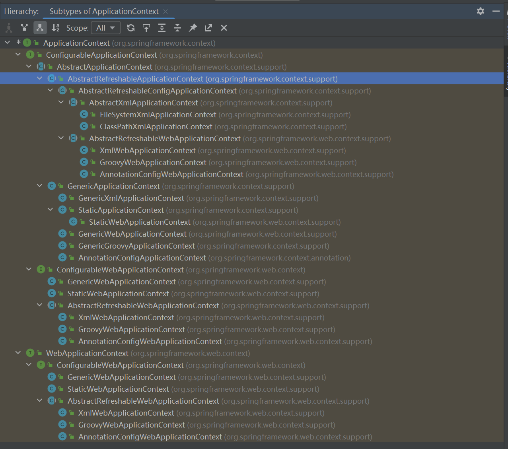

# 工具准备
## maven配置
- 配置本地仓库源
- 配置本地仓库路径

## Tomcat配置
- tomcat下载和使用
- idea配置tomcat启动项
注意：安装Smart Tomcat插件即可创建相应Tomcat启动项

# 从JavaWeb说起
## 目录结构
  Idea创建工程的配置


注意：webapp目录会被tomcat服务器识别并加载
注意上述配置就可以启动一个最基本的服务了！！！


## 三大组件
  JavaWeb三大组件：Servlet、Filter、Listener。https://blog.csdn.net/xiaojie119120/article/details/73274759。均会在web.xml中配置，注意wepapp目录结构。

## 基本流程
- 添加依赖
```markdown
    <!-- 原生Servlet API可实现最原生的JavaWeb功能 -->
    <dependency>
      <groupId>javax.servlet</groupId>
      <artifactId>javax.servlet-api</artifactId>
      <version>4.0.1</version>
      <scope>provided</scope>
    </dependency>
```

- 定义Servlet
```java
/**
 * 纯Servlet API实现的Controller方式！！！
 */
public class HelloController extends HttpServlet {
    @Override
    protected void doGet(HttpServletRequest req, HttpServletResponse resp) throws ServletException, IOException {
        // 设置响应内容类型
        resp.setContentType("text/html");

        String msg = "something return by Servlet";
        // 实际的逻辑是在这里
        PrintWriter out = resp.getWriter();
        out.println("<h1>" + msg + "</h1>");
    }
}
```

- 配置Servlet
```xml
<web-app xmlns="http://xmlns.jcp.org/xml/ns/javaee"
         xmlns:xsi="http://www.w3.org/2001/XMLSchema-instance"
         xsi:schemaLocation="http://xmlns.jcp.org/xml/ns/javaee
                      http://xmlns.jcp.org/xml/ns/javaee/web-app_4_0.xsd"
         version="4.0"
         metadata-complete="true">

    <display-name>Tomcat Documentation</display-name>
    <description>
        SpringWeb example
    </description>

    <servlet>
        <servlet-name>Hello</servlet-name>
        <servlet-class>com.springweb.controller.HelloController</servlet-class>
    </servlet>

    <servlet-mapping>
        <servlet-name>Hello</servlet-name>
        <url-pattern>/hello</url-pattern>
    </servlet-mapping>
</web-app>
```

- 其他
配置Filter等，中文乱码等等。


# SpringWeb/SpringMVC
虽然可以通过最基本的JavaWeb方式写应用，但是一般会使用SpringWeb框架进行JavaWeb开发，因此会选择集成下面依赖。
**注意**，使用Spring会有如下特征，要配置IOC容器的配置内容！！！
## 依赖
```markdown
     <!--使用springcontext，即基本运行环境，有ioc和api和SpEl等内容-->
    <dependency>
      <groupId>org.springframework</groupId>
      <artifactId>spring-context</artifactId>
      <version>5.3.23</version>
    </dependency>
    <!--使用springweb依赖，来进行javaweb开发-->
    <dependency>
      <groupId>org.springframework</groupId>
      <artifactId>spring-web</artifactId>
      <version>5.3.23</version>
    </dependency>
    <!--SpringMVC依赖-->
    <dependency>
      <groupId>org.springframework</groupId>
      <artifactId>spring-webmvc</artifactId>
      <version>5.3.23</version>
    </dependency>
```

## 组件
- DispatchServlet
- Filter
注意：SpringMVC中使用DispatcherServlet来统一托管的请求，这一个中心的Servlet会将各种url再映射到Controller中。

## 配置
### wex.xml配置
- 配置DispatcherServlet
- 配置SpringMVC配置文件路径
```xml
    <!--
    在使用springMVC时，默认的DispatcherServlet在初始化时候会加载Dispatcher-servlet.xml文件，而该文件一般位于WEB-INF下。
    而如果我们将配置写在applicationContext.xml中，就需要在他加载的时候指定需要加载的文件和路径。
      -->
    <!--配置Springmvc的Servlet-->
    <servlet>
        <servlet-name>DispatcherServlet</servlet-name>
        <servlet-class>org.springframework.web.servlet.DispatcherServlet</servlet-class>
        <init-param>
            <param-name>contextConfigLocation</param-name>
            <param-value>classpath:springmvc.xml</param-value>
        </init-param>
        <load-on-startup>1</load-on-startup>
    </servlet>
    <servlet-mapping>
    <servlet-name>DispatcherServlet</servlet-name>
    <url-pattern>/</url-pattern>
    </servlet-mapping>
```

### springmvc容器配置
- 配置beans
```xml
<?xml version="1.0" encoding="UTF-8"?>
<beans xmlns="http://www.springframework.org/schema/beans"
       xmlns:xsi="http://www.w3.org/2001/XMLSchema-instance"
       xsi:schemaLocation="http://www.springframework.org/schema/beans http://www.springframework.org/schema/beans/spring-beans.xsd">

    <bean name="springController" class="com.springweb.controller.SpringController" />
</beans>
```
- 注解扫描beans
```markdown
<?xml version="1.0" encoding="UTF-8"?>
<beans xmlns="http://www.springframework.org/schema/beans"
       xmlns:xsi="http://www.w3.org/2001/XMLSchema-instance"
       xmlns:context="http://www.springframework.org/schema/context"
       xsi:schemaLocation="http://www.springframework.org/schema/beans
       http://www.springframework.org/schema/beans/spring-beans-4.2.xsd
    http://www.springframework.org/schema/context
    http://www.springframework.org/schema/context/spring-context-4.2.xsd">

    <!--手动再ioc容器配置中配置controller bean-->
    <bean name="springController" class="com.springweb.controller.SpringController" />

    <!--自动扫描包实现bean的加载-->
    <!--注意导入context命名空间，xmlns:context="http://www.springframework.org/schema/context"和http://www.springframework.org/schema/context http://www.springframework.org/schema/context/spring-context-4.2.xsd"-->
    <context:component-scan base-package="com.springweb.controller.scan" />
</beans>
```

### 分析总结
- SpringMVC开始引入IOC容器了，所以使用这一模式需要有配置文件，也就是后面的applicationContext.properties等ioc容器配置文件
- bean配置方式从最开始的手动配置过渡到注解扫描配置！！！
- 配置文件设置可以通过再web.xmp中设置DispatcherServlet时加上启动参数指定ioc配置文件位置，也可以直接实现相应接口替代springmvc.xml配置文件的设置
- web服务器如tomcat需要配置web.xml，而使用的springmvc要求设置ioc容器配置，即springmvc/applicationContext内容，其中配置了各种bean
- 区别于自动化加载springmvc配置文件（实际上时web.xml配置DispatcherServlet时出发ioc配置加载），可以手动加载额外的配置文件，即退化不适用springmvc方式，只是使用spring-core\spring-beans中的方法，完成ioc容器的创建
- 其他业务再整合到spring中，都是会从ioc容器配置中关联到外部配置文件，如mybatis等

```java
public class FirstTest {

    @Test
    public void testIoc(){
        ApplicationContext applicationContext = new ClassPathXmlApplicationContext("springmvc.xml");
        Object springController = applicationContext.getBean("springController");
        System.out.println(springController);
    }
}
```
**注意**：上面的测试只是加载了新的ioc容器，而不是使用工程现有的ioc容器（详细未分析）
```java
@SpringBootTest
class NettyDemoApplicationTests {

    @Test
    void contextLoads() {
    }

}
```
**注意**：上面这个才是启动工程现有的ioc容器



# SSM框架整合

## Spring

核心概念：IOC和AOP

- IOC，托管了对象的构建，以及依赖的注入。表现为两个功能：管理（对象自动注册到容器，对象依赖关系自动注入）和提供业务使用随取使用
- AOP，面向切面编程，解决对已有代码非侵入性增强能力，比如事务操作、日志通知等

核心依赖：spring-context，包含的子依赖有spring-core、spring-beans、spring-aop、spring-expression。导入依赖即可使用Spirng基本能力，IOC(DI)、AOP(Aspect)和SpEL表达式等能力，轻量级框架。

<image src="https://pic3.zhimg.com/80/v2-3f419eb834b501683fb78c9871d83b8e_1440w.webp" />

## SpringMVC

> JavaWeb三大组件：Servlet、Filter、Listener。https://blog.csdn.net/xiaojie119120/article/details/73274759。均会在web.xml中配置，注意wepapp目录结构。

- DispatcherServlet
- Filter
- Listener

## Mybatis