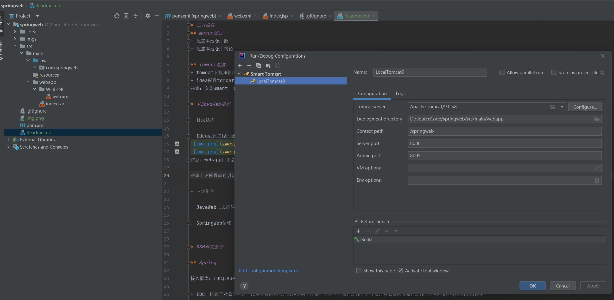

# 工具准备
## maven配置
- 配置本地仓库源
- 配置本地仓库路径

## Tomcat配置
- tomcat下载和使用
- idea配置tomcat启动项
注意：安装Smart Tomcat插件即可创建相应Tomcat启动项

# 从JavaWeb说起
## 目录结构
  Idea创建工程的配置


注意：webapp目录会被tomcat服务器识别并加载
注意上述配置就可以启动一个最基本的服务了！！！


## 三大组件
  JavaWeb三大组件：Servlet、Filter、Listener。https://blog.csdn.net/xiaojie119120/article/details/73274759。均会在web.xml中配置，注意wepapp目录结构。

## 基本流程
- 添加依赖
```markdown
    <!-- 原生Servlet API可实现最原生的JavaWeb功能 -->
    <dependency>
      <groupId>javax.servlet</groupId>
      <artifactId>javax.servlet-api</artifactId>
      <version>4.0.1</version>
      <scope>provided</scope>
    </dependency>
```

- 定义Servlet
```java
/**
 * 纯Servlet API实现的Controller方式！！！
 */
public class HelloController extends HttpServlet {
    @Override
    protected void doGet(HttpServletRequest req, HttpServletResponse resp) throws ServletException, IOException {
        // 设置响应内容类型
        resp.setContentType("text/html");

        String msg = "something return by Servlet";
        // 实际的逻辑是在这里
        PrintWriter out = resp.getWriter();
        out.println("<h1>" + msg + "</h1>");
    }
}
```

- 配置Servlet
```xml
<web-app xmlns="http://xmlns.jcp.org/xml/ns/javaee"
         xmlns:xsi="http://www.w3.org/2001/XMLSchema-instance"
         xsi:schemaLocation="http://xmlns.jcp.org/xml/ns/javaee
                      http://xmlns.jcp.org/xml/ns/javaee/web-app_4_0.xsd"
         version="4.0"
         metadata-complete="true">

    <display-name>Tomcat Documentation</display-name>
    <description>
        SpringWeb example
    </description>

    <servlet>
        <servlet-name>Hello</servlet-name>
        <servlet-class>com.springweb.controller.HelloController</servlet-class>
    </servlet>

    <servlet-mapping>
        <servlet-name>Hello</servlet-name>
        <url-pattern>/hello</url-pattern>
    </servlet-mapping>
</web-app>
```

- 其他
配置Filter等，中文乱码等等。


# SpringWeb
虽然可以通过最基本的JavaWeb方式写应用，但是一般会使用SpringWeb框架进行JavaWeb开发，因此会选择集成下面依赖。
## 依赖
```markdown
    <!--使用springcontext，即基本运行环境，有ioc和api和SpEl等内容-->
    <dependency>
      <groupId>org.springframework</groupId>
      <artifactId>spring-context</artifactId>
      <version>5.3.23</version>
    </dependency>
    <!--使用springweb依赖，来进行javaweb开发-->
    <dependency>
      <groupId>org.springframework</groupId>
      <artifactId>spring-web</artifactId>
      <version>5.3.23</version>
    </dependency>
```

## 配置
其实参考tomcat中example-webapp即可知道。配置Filter、Servlet、Listener等内容。
```xml
<?xml version="1.0" encoding="UTF-8"?>
<!--
  Licensed to the Apache Software Foundation (ASF) under one or more
  contributor license agreements.  See the NOTICE file distributed with
  this work for additional information regarding copyright ownership.
  The ASF licenses this file to You under the Apache License, Version 2.0
  (the "License"); you may not use this file except in compliance with
  the License.  You may obtain a copy of the License at

      http://www.apache.org/licenses/LICENSE-2.0

  Unless required by applicable law or agreed to in writing, software
  distributed under the License is distributed on an "AS IS" BASIS,
  WITHOUT WARRANTIES OR CONDITIONS OF ANY KIND, either express or implied.
  See the License for the specific language governing permissions and
  limitations under the License.
-->
<web-app xmlns="http://xmlns.jcp.org/xml/ns/javaee"
  xmlns:xsi="http://www.w3.org/2001/XMLSchema-instance"
  xsi:schemaLocation="http://xmlns.jcp.org/xml/ns/javaee
                      http://xmlns.jcp.org/xml/ns/javaee/web-app_4_0.xsd"
  version="4.0"
  metadata-complete="true">

    <description>
      Servlet and JSP Examples.
    </description>
    <display-name>Servlet and JSP Examples</display-name>

    <request-character-encoding>UTF-8</request-character-encoding>

    <!-- 配置过滤器，有删减 -->
    <filter>
        <filter-name>Timing Filter</filter-name>
        <filter-class>filters.ExampleFilter</filter-class>
        <init-param>
            <param-name>attribute</param-name>
            <param-value>filters.ExampleFilter</param-value>
        </init-param>
    </filter>
    
    <!-- Enable header security filter for all requests -->
    <filter-mapping>
        <filter-name>HTTP header security filter</filter-name>
        <url-pattern>/*</url-pattern>
    </filter-mapping>

    <!-- 配置监听器，有删减 -->
    <listener>
        <listener-class>listeners.ContextListener</listener-class>
    </listener>
    <listener>
        <listener-class>listeners.SessionListener</listener-class>
    </listener>
    <!-- Define listeners required by examples -->
    <listener>
        <listener-class>async.AsyncStockContextListener</listener-class>
    </listener>

    <!-- 配置Servlet，有删减 -->
    <servlet>
      <servlet-name>ServletToJsp</servlet-name>
      <servlet-class>ServletToJsp</servlet-class>
    </servlet>
    <servlet>
        <servlet-name>CompressionFilterTestServlet</servlet-name>
        <servlet-class>compressionFilters.CompressionFilterTestServlet</servlet-class>
    </servlet>
    <servlet>
        <servlet-name>HelloWorldExample</servlet-name>
        <servlet-class>HelloWorldExample</servlet-class>
    </servlet>

    <servlet-mapping>
        <servlet-name>CompressionFilterTestServlet</servlet-name>
        <url-pattern>/CompressionTest</url-pattern>
    </servlet-mapping>
    <servlet-mapping>
        <servlet-name>HelloWorldExample</servlet-name>
        <url-pattern>/servlets/servlet/HelloWorldExample</url-pattern>
    </servlet-mapping>
    

    <jsp-config>
        <taglib>
            <taglib-uri>
               http://tomcat.apache.org/debug-taglib
            </taglib-uri>
            <taglib-location>
               /WEB-INF/jsp/debug-taglib.tld
            </taglib-location>
        </taglib>

        <taglib>
            <taglib-uri>
               http://tomcat.apache.org/example-taglib
            </taglib-uri>
            <taglib-location>
               /WEB-INF/jsp/example-taglib.tld
            </taglib-location>
        </taglib>

        <taglib>
            <taglib-uri>
               http://tomcat.apache.org/jsp2-example-taglib
            </taglib-uri>
            <taglib-location>
               /WEB-INF/jsp2/jsp2-example-taglib.tld
            </taglib-location>
        </taglib>

        <jsp-property-group>
            <description>
                Special property group for JSP Configuration JSP example.
            </description>
            <display-name>JSPConfiguration</display-name>
            <url-pattern>/jsp/jsp2/misc/config.jsp</url-pattern>
            <el-ignored>true</el-ignored>
            <page-encoding>ISO-8859-1</page-encoding>
            <scripting-invalid>true</scripting-invalid>
            <include-prelude>/jsp/jsp2/misc/prelude.jspf</include-prelude>
            <include-coda>/jsp/jsp2/misc/coda.jspf</include-coda>
        </jsp-property-group>
    </jsp-config>

    <security-constraint>
      <display-name>Example Security Constraint - part 1</display-name>
      <web-resource-collection>
         <web-resource-name>Protected Area - Allow methods</web-resource-name>
         <!-- Define the context-relative URL(s) to be protected -->
         <url-pattern>/jsp/security/protected/*</url-pattern>
         <!-- If you list http methods, only those methods are protected so -->
         <!-- the constraint below ensures all other methods are denied     -->
         <http-method>DELETE</http-method>
         <http-method>GET</http-method>
         <http-method>POST</http-method>
         <http-method>PUT</http-method>
      </web-resource-collection>
      <auth-constraint>
         <!-- Anyone with one of the listed roles may access this area -->
         <role-name>tomcat</role-name>
         <role-name>role1</role-name>
      </auth-constraint>
    </security-constraint>
    <security-constraint>
      <display-name>Example Security Constraint - part 2</display-name>
      <web-resource-collection>
         <web-resource-name>Protected Area - Deny methods</web-resource-name>
         <!-- Define the context-relative URL(s) to be protected -->
         <url-pattern>/jsp/security/protected/*</url-pattern>
         <http-method-omission>DELETE</http-method-omission>
         <http-method-omission>GET</http-method-omission>
         <http-method-omission>POST</http-method-omission>
         <http-method-omission>PUT</http-method-omission>
      </web-resource-collection>
      <!-- An empty auth constraint denies access -->
      <auth-constraint />
    </security-constraint>

    <!-- Default login configuration uses form-based authentication -->
    <login-config>
      <auth-method>FORM</auth-method>
      <realm-name>Example Form-Based Authentication Area</realm-name>
      <form-login-config>
        <form-login-page>/jsp/security/protected/login.jsp</form-login-page>
        <form-error-page>/jsp/security/protected/error.jsp</form-error-page>
      </form-login-config>
    </login-config>

    <!-- Security roles referenced by this web application -->
    <security-role>
      <role-name>role1</role-name>
    </security-role>
    <security-role>
      <role-name>tomcat</role-name>
    </security-role>

    <!-- Environment entry examples -->
    <!--env-entry>
      <env-entry-description>
         The maximum number of tax exemptions allowed to be set.
      </env-entry-description>
      <env-entry-name>maxExemptions</env-entry-name>
      <env-entry-type>java.lang.Integer</env-entry-type>
      <env-entry-value>15</env-entry-value>
    </env-entry-->
    <env-entry>
      <env-entry-name>minExemptions</env-entry-name>
      <env-entry-type>java.lang.Integer</env-entry-type>
      <env-entry-value>1</env-entry-value>
    </env-entry>

    <welcome-file-list>
        <welcome-file>index.html</welcome-file>
        <welcome-file>index.xhtml</welcome-file>
        <welcome-file>index.htm</welcome-file>
        <welcome-file>index.jsp</welcome-file>
    </welcome-file-list>

    <!-- Websocket examples -->
    <listener>
        <listener-class>websocket.drawboard.DrawboardContextListener</listener-class>
    </listener>

</web-app>
```

# SSM框架整合

## Spring

核心概念：IOC和AOP

- IOC，托管了对象的构建，以及依赖的注入。表现为两个功能：管理（对象自动注册到容器，对象依赖关系自动注入）和提供业务使用随取使用
- AOP，面向切面编程，解决对已有代码非侵入性增强能力，比如事务操作、日志通知等

核心依赖：spring-context，包含的子依赖有spring-core、spring-beans、spring-aop、spring-expression。导入依赖即可使用Spirng基本能力，IOC(DI)、AOP(Aspect)和SpEL表达式等能力，轻量级框架。

<image src="https://pic3.zhimg.com/80/v2-3f419eb834b501683fb78c9871d83b8e_1440w.webp" />

## SpringMVC

> JavaWeb三大组件：Servlet、Filter、Listener。https://blog.csdn.net/xiaojie119120/article/details/73274759。均会在web.xml中配置，注意wepapp目录结构。

- DispatcherServlet
- Filter
- Listener

## Mybatis